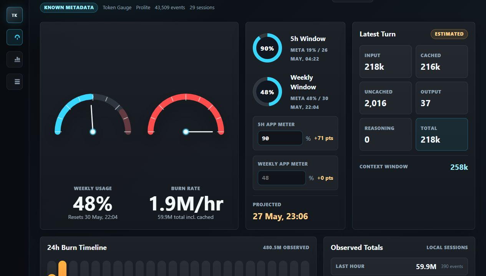
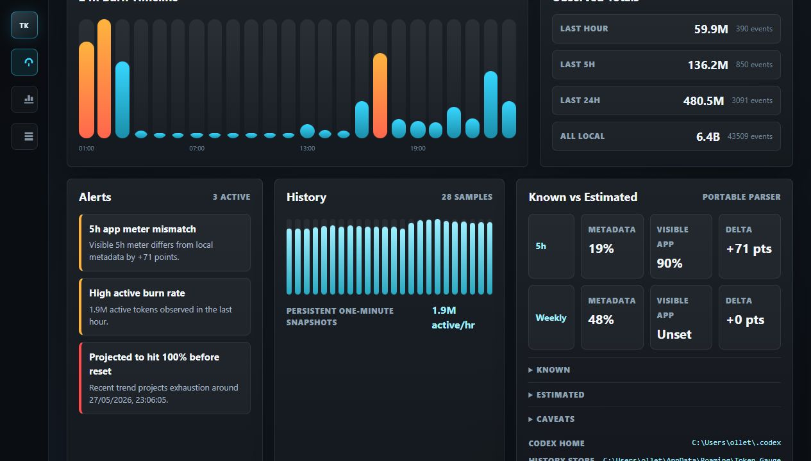
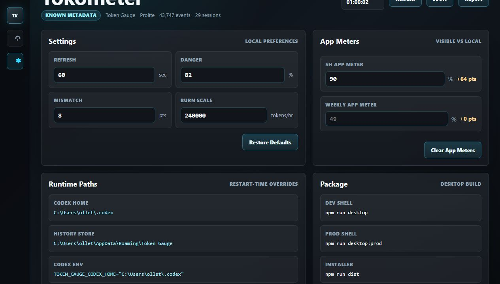

# Tokometer

A real local usage gauge for Codex token burn.

Tokometer reads local Codex `token_count` metadata and turns it into an instrument-cluster dashboard: weekly usage, 5-hour window, burn rate, cached vs active tokens, history, alerts, reports, and heaviest sessions.

It also includes production-readiness surfaces for local installs:

- System Check setup doctor
- Safe diagnostics bundle export
- Local app-meter calibration logbook
- Parser regression fixtures and smoke scenarios
- GitHub Actions CI and packaging workflows

## Screenshots







Repo target:

```text
Martin123132/Tokometer-a-real-usage-gauge-for-Codex-OpenAI-token-burn
```

## What It Reads

Tokometer scans these local Codex folders by default:

```text
~/.codex/sessions
~/.codex/archived_sessions
```

It parses only structured `token_count` JSONL events. It does not need to read full chat text to calculate the gauge.

## Quick Start

```bash
npm install
npm run dev
```

Open:

```text
http://127.0.0.1:5173
```

## Desktop Mode

```bash
npm run desktop
```

This starts the local Vite server and opens Tokometer in an Electron shell with a tray menu where supported.

For a production-style desktop smoke test:

```bash
npm run desktop:prod
```

This builds the client and local parser bundle, then opens Electron against its bundled local server.

## Production Web Server

```bash
npm run start
```

This builds the app and serves the production bundle with the local `/api/usage` endpoint.

## Scripts

```bash
npm run dev       # Vite dev server with local usage API
npm run desktop   # Electron desktop wrapper
npm run desktop:prod # Production-style Electron wrapper
npm run build     # TypeScript + Vite production build
npm run pack      # Build unpacked desktop app into release/
npm run dist      # Build installable desktop artifacts into release/
npm run serve     # Serve an existing dist build
npm run test      # Parser/unit tests
npm run smoke     # Manual smoke scenarios (requires node / scripts/smoke-checks.mjs)
npm run lint      # ESLint
```

## Settings

The Settings view stores local UI preferences in browser/Electron local storage:

- Refresh interval
- Gauge danger threshold
- Visible-vs-local mismatch threshold
- Burn-rate full-scale value
- 5h and weekly app meter overrides
- Parser anomaly policy (`strict`, `normal`, `relaxed`)

Settings also includes:

- **System Check**: verifies local log discovery, token events, history writes, parser quality, freshness, rate confidence, and app-meter calibration.
- **Calibration Logbook**: records visible 5h/weekly app meter samples and their delta from local metadata.

Runtime paths are still process-level settings. Set `TOKEN_GAUGE_CODEX_HOME` or `TOKEN_GAUGE_DATA_DIR` before starting Tokometer when you need to scan or store data somewhere else.

## Portable Paths

Tokometer auto-detects the Codex home folder as `~/.codex`.

Override it when needed:

```bash
TOKEN_GAUGE_CODEX_HOME=/path/to/.codex npm run dev
```

Persistent history is stored outside the repo:

- Windows: `%APPDATA%/Token Gauge/history.jsonl`
- macOS: `~/Library/Application Support/Token Gauge/history.jsonl`
- Linux: `$XDG_DATA_HOME/token-gauge/history.jsonl` or `~/.local/share/token-gauge/history.jsonl`

Override the history folder:

```bash
TOKEN_GAUGE_DATA_DIR=/path/to/tokometer-data npm run dev
```

## Known vs Estimated

Known metadata:

- Codex-provided token totals, cached input counts, output counts, reasoning counts, context window, rate-limit percentages, and reset timestamps when present.
- Per-session cumulative deltas, so repeated `token_count` UI refreshes are not double-counted.

Estimated or local:

- Burn rate is based on recently observed local metadata.
- Active burn is calculated as uncached input + output + reasoning.
- Projection assumes the recent weekly percentage trend continues.

Important caveat: the visible ChatGPT/Codex app meter can include activity Tokometer cannot see locally, or update on a different cadence. Use the `5h App Meter` and `Weekly App Meter` fields to compare the visible app numbers against local metadata.

## Exports

Use the dashboard export buttons to export:

- Raw usage summary JSON
- Markdown report with current limits, burn, alerts, and caveats
- Redacted diagnostics JSON with settings, confidence, parser health, calibration samples, and no raw JSONL content

## Release Builds

Manual GitHub packaging is defined in `.github/workflows/package.yml`.

Locally:

```bash
npm run dist
```

Artifacts are written to `release/`.

CI is defined in `.github/workflows/ci.yml` and runs lint, tests, build, and smoke scenarios on pushes and pull requests to `main`.

## Development Notes

The parser lives in:

```text
server/usage.ts
```

Tests live in:

```text
server/usage.test.ts
```

Parser regression fixtures live in:

```text
server/fixtures
```

The Vite dev server exposes:

```text
/api/health
/api/usage
```

`/api/usage` also accepts `anomalyPolicy` as a query parameter:

```text
/api/usage?anomalyPolicy=relaxed
```

## Privacy

Tokometer is local-first. It does not send your Codex logs anywhere. The dashboard fetches from a local API served by the app process.

## License

PolyForm Noncommercial License 1.0.0. Commercial use requires a separate written license.